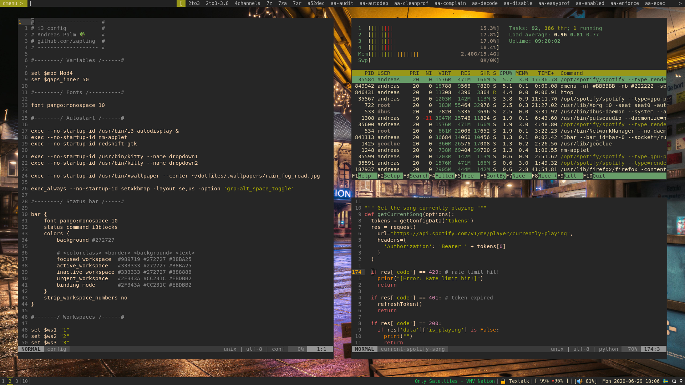

# dotfiles

My configuration and scripts

Custom scripts are located under `bin/`.

- `gr-sync` Sync local git repository diff to a remote server
- `pman` Wrapper script for `pacman`, syntactic sugar `pman {list, fetch, search, install}`
- `personal/5min-break` Display a window reminding you to take breaks every hour, if you are connected to specific VPN.

## Main players

- [i3-gaps](https://github.com/Airblader/i3)
- [i3blocks](https://github.com/vivien/i3blocks)
- [zsh](http://www.zsh.org/) and [oh-my-zsh](https://github.com/ohmyzsh/ohmyzsh)
- [kitty](https://github.com/kovidgoyal/kitty)

